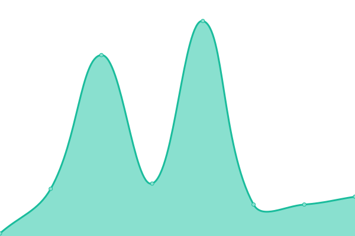
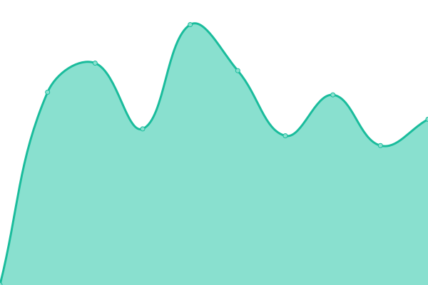

# [📈 Live Status](https://urban-sustainability-lab-zurich.github.io/susdis_monitor): <!--live status--> **🟩 All systems operational**

This repository contains the open-source uptime monitor and status page for [The urban sustainability tiny lab](https://urban-sustainability-lab-zurich.github.io/susdis_monitor), powered by [Upptime](https://github.com/upptime/upptime).

We use [Issues](https://github.com/urban-sustainability-lab-zurich/susdis_monitor/issues) as incident reports, [Actions](https://github.com/urban-sustainability-lab-zurich/susdis_monitor/actions) as uptime monitors, and [Pages](https://urban-sustainability-lab-zurich.github.io/susdis_monitor) for the status page.

<!--start: status pages-->
<!-- This summary is generated by Upptime (https://github.com/upptime/upptime) -->
<!-- Do not edit this manually, your changes will be overwritten -->
<!-- prettier-ignore -->
| URL | Status | History | Response Time | Uptime |
| --- | ------ | ------- | ------------- | ------ |
|  [Main project website (redirect)](https://sustainability.discourses.ch) | 🟩 Up | [main-project-website-redirect.yml](https://github.com/urban-sustainability-lab-zurich/susdis_monitor/commits/HEAD/history/main-project-website-redirect.yml) | 

 103ms
     
 | 

<a href="https://status.discourses.ch/history/main-project-website-redirect">100.00%</a>
    

|  [Main project website (german)](https://sustainability.discourses.ch/de/) | 🟩 Up | [main-project-website-german.yml](https://github.com/urban-sustainability-lab-zurich/susdis_monitor/commits/HEAD/history/main-project-website-german.yml) | 

 48ms
     
 | 

<a href="https://status.discourses.ch/history/main-project-website-german">100.00%</a>
    

|  [Main project website (english)](https://sustainability.discourses.ch/en/) | 🟩 Up | [main-project-website-english.yml](https://github.com/urban-sustainability-lab-zurich/susdis_monitor/commits/HEAD/history/main-project-website-english.yml) | 

 53ms
     
 | 

<a href="https://status.discourses.ch/history/main-project-website-english">100.00%</a>
    

|  [Sustainbility Discourse Map (Zürich)](https://zuerich.sustainability.discourses.ch) | 🟩 Up | [sustainbility-discourse-map-zuerich.yml](https://github.com/urban-sustainability-lab-zurich/susdis_monitor/commits/HEAD/history/sustainbility-discourse-map-zuerich.yml) | 

 965ms
     
 | 

<a href="https://status.discourses.ch/history/sustainbility-discourse-map-zuerich">100.00%</a>
    

|  [Sustainbility Discourse Map (Zürich), Example query topic (parking)](https://zuerich.sustainability.discourses.ch/topic/PRK) | 🟩 Up | [sustainbility-discourse-map-zuerich-example-query-topic-parking.yml](https://github.com/urban-sustainability-lab-zurich/susdis_monitor/commits/HEAD/history/sustainbility-discourse-map-zuerich-example-query-topic-parking.yml) | 

 433ms
     
 | 

<a href="https://status.discourses.ch/history/sustainbility-discourse-map-zuerich-example-query-topic-parking">100.00%</a>
    

<!--end: status pages-->

[**Visit our status website →**](https://urban-sustainability-lab-zurich.github.io/susdis_monitor)

## 📄 License

- Powered by: [Upptime](https://github.com/upptime/upptime)
- Code: [MIT](./LICENSE) © [Anand Chowdhary](https://anandchowdhary.com), supported by [Pabio](https://pabio.com)
- Data in the `./history` directory: [Open Database License](https://opendatacommons.org/licenses/odbl/1-0/)
